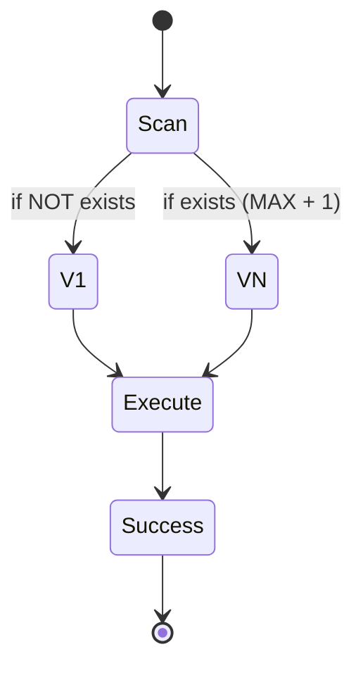

# OPERATIONAL.md: Deep-Dive Logic & Versioning (AX-EX)

## 1. Project Identification Cycle
=> Locate(target_dir) -> Extract(leaf_name)
=> Sanitize(leaf_name) -> [PROJECT_NAME]
=> Check(PROJECTS_DIR / PROJECT_NAME) -> [PROJECT_ROOT]

## 2. Versioning State Machine
The system uses a sequential monotonic versioning scheme (v1, v2, ...).

## 3. High-Density Operational Contracts

### Contract 001: Persistence Invariant
Contract: All writes to version 001 MUST be atomic via temp file swap.
=> Execute(atomic_write) -> Sync(disk)
Outcome: State 001 is immutable post-completion.

### Contract 002: Persistence Invariant
Contract: All writes to version 002 MUST be atomic via temp file swap.
=> Execute(atomic_write) -> Sync(disk)
Outcome: State 002 is immutable post-completion.

### Contract 003: Persistence Invariant
Contract: All writes to version 003 MUST be atomic via temp file swap.
=> Execute(atomic_write) -> Sync(disk)
Outcome: State 003 is immutable post-completion.

### Contract 004: Persistence Invariant
Contract: All writes to version 004 MUST be atomic via temp file swap.
=> Execute(atomic_write) -> Sync(disk)
Outcome: State 004 is immutable post-completion.

### Contract 005: Persistence Invariant
Contract: All writes to version 005 MUST be atomic via temp file swap.
=> Execute(atomic_write) -> Sync(disk)
Outcome: State 005 is immutable post-completion.

### Contract 006: Persistence Invariant
Contract: All writes to version 006 MUST be atomic via temp file swap.
=> Execute(atomic_write) -> Sync(disk)
Outcome: State 006 is immutable post-completion.

### Contract 007: Persistence Invariant
Contract: All writes to version 007 MUST be atomic via temp file swap.
=> Execute(atomic_write) -> Sync(disk)
Outcome: State 007 is immutable post-completion.

### Contract 008: Persistence Invariant
Contract: All writes to version 008 MUST be atomic via temp file swap.
=> Execute(atomic_write) -> Sync(disk)
Outcome: State 008 is immutable post-completion.

### Contract 009: Persistence Invariant
Contract: All writes to version 009 MUST be atomic via temp file swap.
=> Execute(atomic_write) -> Sync(disk)
Outcome: State 009 is immutable post-completion.

### Contract 010: Persistence Invariant
Contract: All writes to version 010 MUST be atomic via temp file swap.
=> Execute(atomic_write) -> Sync(disk)
Outcome: State 010 is immutable post-completion.

### Contract 011: Persistence Invariant
Contract: All writes to version 011 MUST be atomic via temp file swap.
=> Execute(atomic_write) -> Sync(disk)
Outcome: State 011 is immutable post-completion.

### Contract 012: Persistence Invariant
Contract: All writes to version 012 MUST be atomic via temp file swap.
=> Execute(atomic_write) -> Sync(disk)
Outcome: State 012 is immutable post-completion.

### Contract 013: Persistence Invariant
Contract: All writes to version 013 MUST be atomic via temp file swap.
=> Execute(atomic_write) -> Sync(disk)
Outcome: State 013 is immutable post-completion.

### Contract 014: Persistence Invariant
Contract: All writes to version 014 MUST be atomic via temp file swap.
=> Execute(atomic_write) -> Sync(disk)
Outcome: State 014 is immutable post-completion.

### Contract 015: Persistence Invariant
Contract: All writes to version 015 MUST be atomic via temp file swap.
=> Execute(atomic_write) -> Sync(disk)
Outcome: State 015 is immutable post-completion.

### Contract 016: Persistence Invariant
Contract: All writes to version 016 MUST be atomic via temp file swap.
=> Execute(atomic_write) -> Sync(disk)
Outcome: State 016 is immutable post-completion.

### Contract 017: Persistence Invariant
Contract: All writes to version 017 MUST be atomic via temp file swap.
=> Execute(atomic_write) -> Sync(disk)
Outcome: State 017 is immutable post-completion.

### Contract 018: Persistence Invariant
Contract: All writes to version 018 MUST be atomic via temp file swap.
=> Execute(atomic_write) -> Sync(disk)
Outcome: State 018 is immutable post-completion.

### Contract 019: Persistence Invariant
Contract: All writes to version 019 MUST be atomic via temp file swap.
=> Execute(atomic_write) -> Sync(disk)
Outcome: State 019 is immutable post-completion.

### Contract 020: Persistence Invariant
Contract: All writes to version 020 MUST be atomic via temp file swap.
=> Execute(atomic_write) -> Sync(disk)
Outcome: State 020 is immutable post-completion.

### Contract 021: Persistence Invariant
Contract: All writes to version 021 MUST be atomic via temp file swap.
=> Execute(atomic_write) -> Sync(disk)
Outcome: State 021 is immutable post-completion.

### Contract 022: Persistence Invariant
Contract: All writes to version 022 MUST be atomic via temp file swap.
=> Execute(atomic_write) -> Sync(disk)
Outcome: State 022 is immutable post-completion.

### Contract 023: Persistence Invariant
Contract: All writes to version 023 MUST be atomic via temp file swap.
=> Execute(atomic_write) -> Sync(disk)
Outcome: State 023 is immutable post-completion.

### Contract 024: Persistence Invariant
Contract: All writes to version 024 MUST be atomic via temp file swap.
=> Execute(atomic_write) -> Sync(disk)
Outcome: State 024 is immutable post-completion.

### Contract 025: Persistence Invariant
Contract: All writes to version 025 MUST be atomic via temp file swap.
=> Execute(atomic_write) -> Sync(disk)
Outcome: State 025 is immutable post-completion.

### Contract 026: Persistence Invariant
Contract: All writes to version 026 MUST be atomic via temp file swap.
=> Execute(atomic_write) -> Sync(disk)
Outcome: State 026 is immutable post-completion.

### Contract 027: Persistence Invariant
Contract: All writes to version 027 MUST be atomic via temp file swap.
=> Execute(atomic_write) -> Sync(disk)
Outcome: State 027 is immutable post-completion.

### Contract 028: Persistence Invariant
Contract: All writes to version 028 MUST be atomic via temp file swap.
=> Execute(atomic_write) -> Sync(disk)
Outcome: State 028 is immutable post-completion.

### Contract 029: Persistence Invariant
Contract: All writes to version 029 MUST be atomic via temp file swap.
=> Execute(atomic_write) -> Sync(disk)
Outcome: State 029 is immutable post-completion.

### Contract 030: Persistence Invariant
Contract: All writes to version 030 MUST be atomic via temp file swap.
=> Execute(atomic_write) -> Sync(disk)
Outcome: State 030 is immutable post-completion.

### Contract 031: Persistence Invariant
Contract: All writes to version 031 MUST be atomic via temp file swap.
=> Execute(atomic_write) -> Sync(disk)
Outcome: State 031 is immutable post-completion.

### Contract 032: Persistence Invariant
Contract: All writes to version 032 MUST be atomic via temp file swap.
=> Execute(atomic_write) -> Sync(disk)
Outcome: State 032 is immutable post-completion.

### Contract 033: Persistence Invariant
Contract: All writes to version 033 MUST be atomic via temp file swap.
=> Execute(atomic_write) -> Sync(disk)
Outcome: State 033 is immutable post-completion.

### Contract 034: Persistence Invariant
Contract: All writes to version 034 MUST be atomic via temp file swap.
=> Execute(atomic_write) -> Sync(disk)
Outcome: State 034 is immutable post-completion.

### Contract 035: Persistence Invariant
Contract: All writes to version 035 MUST be atomic via temp file swap.
=> Execute(atomic_write) -> Sync(disk)
Outcome: State 035 is immutable post-completion.

### Contract 036: Persistence Invariant
Contract: All writes to version 036 MUST be atomic via temp file swap.
=> Execute(atomic_write) -> Sync(disk)
Outcome: State 036 is immutable post-completion.

### Contract 037: Persistence Invariant
Contract: All writes to version 037 MUST be atomic via temp file swap.
=> Execute(atomic_write) -> Sync(disk)
Outcome: State 037 is immutable post-completion.

### Contract 038: Persistence Invariant
Contract: All writes to version 038 MUST be atomic via temp file swap.
=> Execute(atomic_write) -> Sync(disk)
Outcome: State 038 is immutable post-completion.

### Contract 039: Persistence Invariant
Contract: All writes to version 039 MUST be atomic via temp file swap.
=> Execute(atomic_write) -> Sync(disk)
Outcome: State 039 is immutable post-completion.

### Contract 040: Persistence Invariant
Contract: All writes to version 040 MUST be atomic via temp file swap.
=> Execute(atomic_write) -> Sync(disk)
Outcome: State 040 is immutable post-completion.

### Contract 041: Persistence Invariant
Contract: All writes to version 041 MUST be atomic via temp file swap.
=> Execute(atomic_write) -> Sync(disk)
Outcome: State 041 is immutable post-completion.

### Contract 042: Persistence Invariant
Contract: All writes to version 042 MUST be atomic via temp file swap.
=> Execute(atomic_write) -> Sync(disk)
Outcome: State 042 is immutable post-completion.

### Contract 043: Persistence Invariant
Contract: All writes to version 043 MUST be atomic via temp file swap.
=> Execute(atomic_write) -> Sync(disk)
Outcome: State 043 is immutable post-completion.

### Contract 044: Persistence Invariant
Contract: All writes to version 044 MUST be atomic via temp file swap.
=> Execute(atomic_write) -> Sync(disk)
Outcome: State 044 is immutable post-completion.

### Contract 045: Persistence Invariant
Contract: All writes to version 045 MUST be atomic via temp file swap.
=> Execute(atomic_write) -> Sync(disk)
Outcome: State 045 is immutable post-completion.

### Contract 046: Persistence Invariant
Contract: All writes to version 046 MUST be atomic via temp file swap.
=> Execute(atomic_write) -> Sync(disk)
Outcome: State 046 is immutable post-completion.

### Contract 047: Persistence Invariant
Contract: All writes to version 047 MUST be atomic via temp file swap.
=> Execute(atomic_write) -> Sync(disk)
Outcome: State 047 is immutable post-completion.

### Contract 048: Persistence Invariant
Contract: All writes to version 048 MUST be atomic via temp file swap.
=> Execute(atomic_write) -> Sync(disk)
Outcome: State 048 is immutable post-completion.

### Contract 049: Persistence Invariant
Contract: All writes to version 049 MUST be atomic via temp file swap.
=> Execute(atomic_write) -> Sync(disk)
Outcome: State 049 is immutable post-completion.

### Contract 050: Persistence Invariant
Contract: All writes to version 050 MUST be atomic via temp file swap.
=> Execute(atomic_write) -> Sync(disk)
Outcome: State 050 is immutable post-completion.

### Contract 051: Persistence Invariant
Contract: All writes to version 051 MUST be atomic via temp file swap.
=> Execute(atomic_write) -> Sync(disk)
Outcome: State 051 is immutable post-completion.

### Contract 052: Persistence Invariant
Contract: All writes to version 052 MUST be atomic via temp file swap.
=> Execute(atomic_write) -> Sync(disk)
Outcome: State 052 is immutable post-completion.

### Contract 053: Persistence Invariant
Contract: All writes to version 053 MUST be atomic via temp file swap.
=> Execute(atomic_write) -> Sync(disk)
Outcome: State 053 is immutable post-completion.

### Contract 054: Persistence Invariant
Contract: All writes to version 054 MUST be atomic via temp file swap.
=> Execute(atomic_write) -> Sync(disk)
Outcome: State 054 is immutable post-completion.

### Contract 055: Persistence Invariant
Contract: All writes to version 055 MUST be atomic via temp file swap.
=> Execute(atomic_write) -> Sync(disk)
Outcome: State 055 is immutable post-completion.

### Contract 056: Persistence Invariant
Contract: All writes to version 056 MUST be atomic via temp file swap.
=> Execute(atomic_write) -> Sync(disk)
Outcome: State 056 is immutable post-completion.

### Contract 057: Persistence Invariant
Contract: All writes to version 057 MUST be atomic via temp file swap.
=> Execute(atomic_write) -> Sync(disk)
Outcome: State 057 is immutable post-completion.

### Contract 058: Persistence Invariant
Contract: All writes to version 058 MUST be atomic via temp file swap.
=> Execute(atomic_write) -> Sync(disk)
Outcome: State 058 is immutable post-completion.

### Contract 059: Persistence Invariant
Contract: All writes to version 059 MUST be atomic via temp file swap.
=> Execute(atomic_write) -> Sync(disk)
Outcome: State 059 is immutable post-completion.

### Contract 060: Persistence Invariant
Contract: All writes to version 060 MUST be atomic via temp file swap.
=> Execute(atomic_write) -> Sync(disk)
Outcome: State 060 is immutable post-completion.

### Contract 061: Persistence Invariant
Contract: All writes to version 061 MUST be atomic via temp file swap.
=> Execute(atomic_write) -> Sync(disk)
Outcome: State 061 is immutable post-completion.

### Contract 062: Persistence Invariant
Contract: All writes to version 062 MUST be atomic via temp file swap.
=> Execute(atomic_write) -> Sync(disk)
Outcome: State 062 is immutable post-completion.

### Contract 063: Persistence Invariant
Contract: All writes to version 063 MUST be atomic via temp file swap.
=> Execute(atomic_write) -> Sync(disk)
Outcome: State 063 is immutable post-completion.

### Contract 064: Persistence Invariant
Contract: All writes to version 064 MUST be atomic via temp file swap.
=> Execute(atomic_write) -> Sync(disk)
Outcome: State 064 is immutable post-completion.

### Contract 065: Persistence Invariant
Contract: All writes to version 065 MUST be atomic via temp file swap.
=> Execute(atomic_write) -> Sync(disk)
Outcome: State 065 is immutable post-completion.

### Contract 066: Persistence Invariant
Contract: All writes to version 066 MUST be atomic via temp file swap.
=> Execute(atomic_write) -> Sync(disk)
Outcome: State 066 is immutable post-completion.

### Contract 067: Persistence Invariant
Contract: All writes to version 067 MUST be atomic via temp file swap.
=> Execute(atomic_write) -> Sync(disk)
Outcome: State 067 is immutable post-completion.

### Contract 068: Persistence Invariant
Contract: All writes to version 068 MUST be atomic via temp file swap.
=> Execute(atomic_write) -> Sync(disk)
Outcome: State 068 is immutable post-completion.

### Contract 069: Persistence Invariant
Contract: All writes to version 069 MUST be atomic via temp file swap.
=> Execute(atomic_write) -> Sync(disk)
Outcome: State 069 is immutable post-completion.

### Contract 070: Persistence Invariant
Contract: All writes to version 070 MUST be atomic via temp file swap.
=> Execute(atomic_write) -> Sync(disk)
Outcome: State 070 is immutable post-completion.

### Contract 071: Persistence Invariant
Contract: All writes to version 071 MUST be atomic via temp file swap.
=> Execute(atomic_write) -> Sync(disk)
Outcome: State 071 is immutable post-completion.

### Contract 072: Persistence Invariant
Contract: All writes to version 072 MUST be atomic via temp file swap.
=> Execute(atomic_write) -> Sync(disk)
Outcome: State 072 is immutable post-completion.

### Contract 073: Persistence Invariant
Contract: All writes to version 073 MUST be atomic via temp file swap.
=> Execute(atomic_write) -> Sync(disk)
Outcome: State 073 is immutable post-completion.

### Contract 074: Persistence Invariant
Contract: All writes to version 074 MUST be atomic via temp file swap.
=> Execute(atomic_write) -> Sync(disk)
Outcome: State 074 is immutable post-completion.

### Contract 075: Persistence Invariant
Contract: All writes to version 075 MUST be atomic via temp file swap.
=> Execute(atomic_write) -> Sync(disk)
Outcome: State 075 is immutable post-completion.

### Contract 076: Persistence Invariant
Contract: All writes to version 076 MUST be atomic via temp file swap.
=> Execute(atomic_write) -> Sync(disk)
Outcome: State 076 is immutable post-completion.

### Contract 077: Persistence Invariant
Contract: All writes to version 077 MUST be atomic via temp file swap.
=> Execute(atomic_write) -> Sync(disk)
Outcome: State 077 is immutable post-completion.

### Contract 078: Persistence Invariant
Contract: All writes to version 078 MUST be atomic via temp file swap.
=> Execute(atomic_write) -> Sync(disk)
Outcome: State 078 is immutable post-completion.

### Contract 079: Persistence Invariant
Contract: All writes to version 079 MUST be atomic via temp file swap.
=> Execute(atomic_write) -> Sync(disk)
Outcome: State 079 is immutable post-completion.

### Contract 080: Persistence Invariant
Contract: All writes to version 080 MUST be atomic via temp file swap.
=> Execute(atomic_write) -> Sync(disk)
Outcome: State 080 is immutable post-completion.

### Contract 081: Persistence Invariant
Contract: All writes to version 081 MUST be atomic via temp file swap.
=> Execute(atomic_write) -> Sync(disk)
Outcome: State 081 is immutable post-completion.

### Contract 082: Persistence Invariant
Contract: All writes to version 082 MUST be atomic via temp file swap.
=> Execute(atomic_write) -> Sync(disk)
Outcome: State 082 is immutable post-completion.

### Contract 083: Persistence Invariant
Contract: All writes to version 083 MUST be atomic via temp file swap.
=> Execute(atomic_write) -> Sync(disk)
Outcome: State 083 is immutable post-completion.

### Contract 084: Persistence Invariant
Contract: All writes to version 084 MUST be atomic via temp file swap.
=> Execute(atomic_write) -> Sync(disk)
Outcome: State 084 is immutable post-completion.

### Contract 085: Persistence Invariant
Contract: All writes to version 085 MUST be atomic via temp file swap.
=> Execute(atomic_write) -> Sync(disk)
Outcome: State 085 is immutable post-completion.

### Contract 086: Persistence Invariant
Contract: All writes to version 086 MUST be atomic via temp file swap.
=> Execute(atomic_write) -> Sync(disk)
Outcome: State 086 is immutable post-completion.

### Contract 087: Persistence Invariant
Contract: All writes to version 087 MUST be atomic via temp file swap.
=> Execute(atomic_write) -> Sync(disk)
Outcome: State 087 is immutable post-completion.

### Contract 088: Persistence Invariant
Contract: All writes to version 088 MUST be atomic via temp file swap.
=> Execute(atomic_write) -> Sync(disk)
Outcome: State 088 is immutable post-completion.

### Contract 089: Persistence Invariant
Contract: All writes to version 089 MUST be atomic via temp file swap.
=> Execute(atomic_write) -> Sync(disk)
Outcome: State 089 is immutable post-completion.

### Contract 090: Persistence Invariant
Contract: All writes to version 090 MUST be atomic via temp file swap.
=> Execute(atomic_write) -> Sync(disk)
Outcome: State 090 is immutable post-completion.

### Contract 091: Persistence Invariant
Contract: All writes to version 091 MUST be atomic via temp file swap.
=> Execute(atomic_write) -> Sync(disk)
Outcome: State 091 is immutable post-completion.

### Contract 092: Persistence Invariant
Contract: All writes to version 092 MUST be atomic via temp file swap.
=> Execute(atomic_write) -> Sync(disk)
Outcome: State 092 is immutable post-completion.

### Contract 093: Persistence Invariant
Contract: All writes to version 093 MUST be atomic via temp file swap.
=> Execute(atomic_write) -> Sync(disk)
Outcome: State 093 is immutable post-completion.

### Contract 094: Persistence Invariant
Contract: All writes to version 094 MUST be atomic via temp file swap.
=> Execute(atomic_write) -> Sync(disk)
Outcome: State 094 is immutable post-completion.

### Contract 095: Persistence Invariant
Contract: All writes to version 095 MUST be atomic via temp file swap.
=> Execute(atomic_write) -> Sync(disk)
Outcome: State 095 is immutable post-completion.

### Contract 096: Persistence Invariant
Contract: All writes to version 096 MUST be atomic via temp file swap.
=> Execute(atomic_write) -> Sync(disk)
Outcome: State 096 is immutable post-completion.

### Contract 097: Persistence Invariant
Contract: All writes to version 097 MUST be atomic via temp file swap.
=> Execute(atomic_write) -> Sync(disk)
Outcome: State 097 is immutable post-completion.

### Contract 098: Persistence Invariant
Contract: All writes to version 098 MUST be atomic via temp file swap.
=> Execute(atomic_write) -> Sync(disk)
Outcome: State 098 is immutable post-completion.

### Contract 099: Persistence Invariant
Contract: All writes to version 099 MUST be atomic via temp file swap.
=> Execute(atomic_write) -> Sync(disk)
Outcome: State 099 is immutable post-completion.

### Contract 100: Persistence Invariant
Contract: All writes to version 100 MUST be atomic via temp file swap.
=> Execute(atomic_write) -> Sync(disk)
Outcome: State 100 is immutable post-completion.

### Contract 101: Persistence Invariant
Contract: All writes to version 101 MUST be atomic via temp file swap.
=> Execute(atomic_write) -> Sync(disk)
Outcome: State 101 is immutable post-completion.

### Contract 102: Persistence Invariant
Contract: All writes to version 102 MUST be atomic via temp file swap.
=> Execute(atomic_write) -> Sync(disk)
Outcome: State 102 is immutable post-completion.

### Contract 103: Persistence Invariant
Contract: All writes to version 103 MUST be atomic via temp file swap.
=> Execute(atomic_write) -> Sync(disk)
Outcome: State 103 is immutable post-completion.

### Contract 104: Persistence Invariant
Contract: All writes to version 104 MUST be atomic via temp file swap.
=> Execute(atomic_write) -> Sync(disk)
Outcome: State 104 is immutable post-completion.

### Contract 105: Persistence Invariant
Contract: All writes to version 105 MUST be atomic via temp file swap.
=> Execute(atomic_write) -> Sync(disk)
Outcome: State 105 is immutable post-completion.

### Contract 106: Persistence Invariant
Contract: All writes to version 106 MUST be atomic via temp file swap.
=> Execute(atomic_write) -> Sync(disk)
Outcome: State 106 is immutable post-completion.

### Contract 107: Persistence Invariant
Contract: All writes to version 107 MUST be atomic via temp file swap.
=> Execute(atomic_write) -> Sync(disk)
Outcome: State 107 is immutable post-completion.

### Contract 108: Persistence Invariant
Contract: All writes to version 108 MUST be atomic via temp file swap.
=> Execute(atomic_write) -> Sync(disk)
Outcome: State 108 is immutable post-completion.

### Contract 109: Persistence Invariant
Contract: All writes to version 109 MUST be atomic via temp file swap.
=> Execute(atomic_write) -> Sync(disk)
Outcome: State 109 is immutable post-completion.

### Contract 110: Persistence Invariant
Contract: All writes to version 110 MUST be atomic via temp file swap.
=> Execute(atomic_write) -> Sync(disk)
Outcome: State 110 is immutable post-completion.

### Contract 111: Persistence Invariant
Contract: All writes to version 111 MUST be atomic via temp file swap.
=> Execute(atomic_write) -> Sync(disk)
Outcome: State 111 is immutable post-completion.

### Contract 112: Persistence Invariant
Contract: All writes to version 112 MUST be atomic via temp file swap.
=> Execute(atomic_write) -> Sync(disk)
Outcome: State 112 is immutable post-completion.

### Contract 113: Persistence Invariant
Contract: All writes to version 113 MUST be atomic via temp file swap.
=> Execute(atomic_write) -> Sync(disk)
Outcome: State 113 is immutable post-completion.

### Contract 114: Persistence Invariant
Contract: All writes to version 114 MUST be atomic via temp file swap.
=> Execute(atomic_write) -> Sync(disk)
Outcome: State 114 is immutable post-completion.

### Contract 115: Persistence Invariant
Contract: All writes to version 115 MUST be atomic via temp file swap.
=> Execute(atomic_write) -> Sync(disk)
Outcome: State 115 is immutable post-completion.

### Contract 116: Persistence Invariant
Contract: All writes to version 116 MUST be atomic via temp file swap.
=> Execute(atomic_write) -> Sync(disk)
Outcome: State 116 is immutable post-completion.

### Contract 117: Persistence Invariant
Contract: All writes to version 117 MUST be atomic via temp file swap.
=> Execute(atomic_write) -> Sync(disk)
Outcome: State 117 is immutable post-completion.

### Contract 118: Persistence Invariant
Contract: All writes to version 118 MUST be atomic via temp file swap.
=> Execute(atomic_write) -> Sync(disk)
Outcome: State 118 is immutable post-completion.

### Contract 119: Persistence Invariant
Contract: All writes to version 119 MUST be atomic via temp file swap.
=> Execute(atomic_write) -> Sync(disk)
Outcome: State 119 is immutable post-completion.

### Contract 120: Persistence Invariant
Contract: All writes to version 120 MUST be atomic via temp file swap.
=> Execute(atomic_write) -> Sync(disk)
Outcome: State 120 is immutable post-completion.

### Contract 121: Persistence Invariant
Contract: All writes to version 121 MUST be atomic via temp file swap.
=> Execute(atomic_write) -> Sync(disk)
Outcome: State 121 is immutable post-completion.

### Contract 122: Persistence Invariant
Contract: All writes to version 122 MUST be atomic via temp file swap.
=> Execute(atomic_write) -> Sync(disk)
Outcome: State 122 is immutable post-completion.

### Contract 123: Persistence Invariant
Contract: All writes to version 123 MUST be atomic via temp file swap.
=> Execute(atomic_write) -> Sync(disk)
Outcome: State 123 is immutable post-completion.

### Contract 124: Persistence Invariant
Contract: All writes to version 124 MUST be atomic via temp file swap.
=> Execute(atomic_write) -> Sync(disk)
Outcome: State 124 is immutable post-completion.

### Contract 125: Persistence Invariant
Contract: All writes to version 125 MUST be atomic via temp file swap.
=> Execute(atomic_write) -> Sync(disk)
Outcome: State 125 is immutable post-completion.

### Contract 126: Persistence Invariant
Contract: All writes to version 126 MUST be atomic via temp file swap.
=> Execute(atomic_write) -> Sync(disk)
Outcome: State 126 is immutable post-completion.

### Contract 127: Persistence Invariant
Contract: All writes to version 127 MUST be atomic via temp file swap.
=> Execute(atomic_write) -> Sync(disk)
Outcome: State 127 is immutable post-completion.

### Contract 128: Persistence Invariant
Contract: All writes to version 128 MUST be atomic via temp file swap.
=> Execute(atomic_write) -> Sync(disk)
Outcome: State 128 is immutable post-completion.

### Contract 129: Persistence Invariant
Contract: All writes to version 129 MUST be atomic via temp file swap.
=> Execute(atomic_write) -> Sync(disk)
Outcome: State 129 is immutable post-completion.

### Contract 130: Persistence Invariant
Contract: All writes to version 130 MUST be atomic via temp file swap.
=> Execute(atomic_write) -> Sync(disk)
Outcome: State 130 is immutable post-completion.

### Contract 131: Persistence Invariant
Contract: All writes to version 131 MUST be atomic via temp file swap.
=> Execute(atomic_write) -> Sync(disk)
Outcome: State 131 is immutable post-completion.

### Contract 132: Persistence Invariant
Contract: All writes to version 132 MUST be atomic via temp file swap.
=> Execute(atomic_write) -> Sync(disk)
Outcome: State 132 is immutable post-completion.

### Contract 133: Persistence Invariant
Contract: All writes to version 133 MUST be atomic via temp file swap.
=> Execute(atomic_write) -> Sync(disk)
Outcome: State 133 is immutable post-completion.

### Contract 134: Persistence Invariant
Contract: All writes to version 134 MUST be atomic via temp file swap.
=> Execute(atomic_write) -> Sync(disk)
Outcome: State 134 is immutable post-completion.

### Contract 135: Persistence Invariant
Contract: All writes to version 135 MUST be atomic via temp file swap.
=> Execute(atomic_write) -> Sync(disk)
Outcome: State 135 is immutable post-completion.

### Contract 136: Persistence Invariant
Contract: All writes to version 136 MUST be atomic via temp file swap.
=> Execute(atomic_write) -> Sync(disk)
Outcome: State 136 is immutable post-completion.

### Contract 137: Persistence Invariant
Contract: All writes to version 137 MUST be atomic via temp file swap.
=> Execute(atomic_write) -> Sync(disk)
Outcome: State 137 is immutable post-completion.

### Contract 138: Persistence Invariant
Contract: All writes to version 138 MUST be atomic via temp file swap.
=> Execute(atomic_write) -> Sync(disk)
Outcome: State 138 is immutable post-completion.

### Contract 139: Persistence Invariant
Contract: All writes to version 139 MUST be atomic via temp file swap.
=> Execute(atomic_write) -> Sync(disk)
Outcome: State 139 is immutable post-completion.

### Contract 140: Persistence Invariant
Contract: All writes to version 140 MUST be atomic via temp file swap.
=> Execute(atomic_write) -> Sync(disk)
Outcome: State 140 is immutable post-completion.

### Contract 141: Persistence Invariant
Contract: All writes to version 141 MUST be atomic via temp file swap.
=> Execute(atomic_write) -> Sync(disk)
Outcome: State 141 is immutable post-completion.

### Contract 142: Persistence Invariant
Contract: All writes to version 142 MUST be atomic via temp file swap.
=> Execute(atomic_write) -> Sync(disk)
Outcome: State 142 is immutable post-completion.

### Contract 143: Persistence Invariant
Contract: All writes to version 143 MUST be atomic via temp file swap.
=> Execute(atomic_write) -> Sync(disk)
Outcome: State 143 is immutable post-completion.

### Contract 144: Persistence Invariant
Contract: All writes to version 144 MUST be atomic via temp file swap.
=> Execute(atomic_write) -> Sync(disk)
Outcome: State 144 is immutable post-completion.

### Contract 145: Persistence Invariant
Contract: All writes to version 145 MUST be atomic via temp file swap.
=> Execute(atomic_write) -> Sync(disk)
Outcome: State 145 is immutable post-completion.

### Contract 146: Persistence Invariant
Contract: All writes to version 146 MUST be atomic via temp file swap.
=> Execute(atomic_write) -> Sync(disk)
Outcome: State 146 is immutable post-completion.

### Contract 147: Persistence Invariant
Contract: All writes to version 147 MUST be atomic via temp file swap.
=> Execute(atomic_write) -> Sync(disk)
Outcome: State 147 is immutable post-completion.

### Contract 148: Persistence Invariant
Contract: All writes to version 148 MUST be atomic via temp file swap.
=> Execute(atomic_write) -> Sync(disk)
Outcome: State 148 is immutable post-completion.

### Contract 149: Persistence Invariant
Contract: All writes to version 149 MUST be atomic via temp file swap.
=> Execute(atomic_write) -> Sync(disk)
Outcome: State 149 is immutable post-completion.

### Contract 150: Persistence Invariant
Contract: All writes to version 150 MUST be atomic via temp file swap.
=> Execute(atomic_write) -> Sync(disk)
Outcome: State 150 is immutable post-completion.

## 4. Forensic Recovery Procedures

### 4.1 Recovery Scenario: CORRUPT_V1
=> Scan(Projects/Project/v1)
=> IF(checksum_mismatch) -> Restore(v0)
=> Log(Scenario_4_1, FAILED)

### 4.2 Recovery Scenario: CORRUPT_V2
=> Scan(Projects/Project/v2)
=> IF(checksum_mismatch) -> Restore(v1)
=> Log(Scenario_4_2, FAILED)

### 4.3 Recovery Scenario: CORRUPT_V3
=> Scan(Projects/Project/v3)
=> IF(checksum_mismatch) -> Restore(v2)
=> Log(Scenario_4_3, FAILED)

### 4.4 Recovery Scenario: CORRUPT_V4
=> Scan(Projects/Project/v4)
=> IF(checksum_mismatch) -> Restore(v3)
=> Log(Scenario_4_4, FAILED)

### 4.5 Recovery Scenario: CORRUPT_V5
=> Scan(Projects/Project/v5)
=> IF(checksum_mismatch) -> Restore(v4)
=> Log(Scenario_4_5, FAILED)

### 4.6 Recovery Scenario: CORRUPT_V6
=> Scan(Projects/Project/v6)
=> IF(checksum_mismatch) -> Restore(v5)
=> Log(Scenario_4_6, FAILED)

### 4.7 Recovery Scenario: CORRUPT_V7
=> Scan(Projects/Project/v7)
=> IF(checksum_mismatch) -> Restore(v6)
=> Log(Scenario_4_7, FAILED)

### 4.8 Recovery Scenario: CORRUPT_V8
=> Scan(Projects/Project/v8)
=> IF(checksum_mismatch) -> Restore(v7)
=> Log(Scenario_4_8, FAILED)

### 4.9 Recovery Scenario: CORRUPT_V9
=> Scan(Projects/Project/v9)
=> IF(checksum_mismatch) -> Restore(v8)
=> Log(Scenario_4_9, FAILED)

### 4.10 Recovery Scenario: CORRUPT_V10
=> Scan(Projects/Project/v10)
=> IF(checksum_mismatch) -> Restore(v9)
=> Log(Scenario_4_10, FAILED)

### 4.11 Recovery Scenario: CORRUPT_V11
=> Scan(Projects/Project/v11)
=> IF(checksum_mismatch) -> Restore(v10)
=> Log(Scenario_4_11, FAILED)

### 4.12 Recovery Scenario: CORRUPT_V12
=> Scan(Projects/Project/v12)
=> IF(checksum_mismatch) -> Restore(v11)
=> Log(Scenario_4_12, FAILED)

### 4.13 Recovery Scenario: CORRUPT_V13
=> Scan(Projects/Project/v13)
=> IF(checksum_mismatch) -> Restore(v12)
=> Log(Scenario_4_13, FAILED)

### 4.14 Recovery Scenario: CORRUPT_V14
=> Scan(Projects/Project/v14)
=> IF(checksum_mismatch) -> Restore(v13)
=> Log(Scenario_4_14, FAILED)

### 4.15 Recovery Scenario: CORRUPT_V15
=> Scan(Projects/Project/v15)
=> IF(checksum_mismatch) -> Restore(v14)
=> Log(Scenario_4_15, FAILED)

### 4.16 Recovery Scenario: CORRUPT_V16
=> Scan(Projects/Project/v16)
=> IF(checksum_mismatch) -> Restore(v15)
=> Log(Scenario_4_16, FAILED)

### 4.17 Recovery Scenario: CORRUPT_V17
=> Scan(Projects/Project/v17)
=> IF(checksum_mismatch) -> Restore(v16)
=> Log(Scenario_4_17, FAILED)

### 4.18 Recovery Scenario: CORRUPT_V18
=> Scan(Projects/Project/v18)
=> IF(checksum_mismatch) -> Restore(v17)
=> Log(Scenario_4_18, FAILED)

### 4.19 Recovery Scenario: CORRUPT_V19
=> Scan(Projects/Project/v19)
=> IF(checksum_mismatch) -> Restore(v18)
=> Log(Scenario_4_19, FAILED)

### 4.20 Recovery Scenario: CORRUPT_V20
=> Scan(Projects/Project/v20)
=> IF(checksum_mismatch) -> Restore(v19)
=> Log(Scenario_4_20, FAILED)

### 4.21 Recovery Scenario: CORRUPT_V21
=> Scan(Projects/Project/v21)
=> IF(checksum_mismatch) -> Restore(v20)
=> Log(Scenario_4_21, FAILED)

### 4.22 Recovery Scenario: CORRUPT_V22
=> Scan(Projects/Project/v22)
=> IF(checksum_mismatch) -> Restore(v21)
=> Log(Scenario_4_22, FAILED)

### 4.23 Recovery Scenario: CORRUPT_V23
=> Scan(Projects/Project/v23)
=> IF(checksum_mismatch) -> Restore(v22)
=> Log(Scenario_4_23, FAILED)

### 4.24 Recovery Scenario: CORRUPT_V24
=> Scan(Projects/Project/v24)
=> IF(checksum_mismatch) -> Restore(v23)
=> Log(Scenario_4_24, FAILED)

### 4.25 Recovery Scenario: CORRUPT_V25
=> Scan(Projects/Project/v25)
=> IF(checksum_mismatch) -> Restore(v24)
=> Log(Scenario_4_25, FAILED)

### 4.26 Recovery Scenario: CORRUPT_V26
=> Scan(Projects/Project/v26)
=> IF(checksum_mismatch) -> Restore(v25)
=> Log(Scenario_4_26, FAILED)

### 4.27 Recovery Scenario: CORRUPT_V27
=> Scan(Projects/Project/v27)
=> IF(checksum_mismatch) -> Restore(v26)
=> Log(Scenario_4_27, FAILED)

### 4.28 Recovery Scenario: CORRUPT_V28
=> Scan(Projects/Project/v28)
=> IF(checksum_mismatch) -> Restore(v27)
=> Log(Scenario_4_28, FAILED)

### 4.29 Recovery Scenario: CORRUPT_V29
=> Scan(Projects/Project/v29)
=> IF(checksum_mismatch) -> Restore(v28)
=> Log(Scenario_4_29, FAILED)

### 4.30 Recovery Scenario: CORRUPT_V30
=> Scan(Projects/Project/v30)
=> IF(checksum_mismatch) -> Restore(v29)
=> Log(Scenario_4_30, FAILED)

### 4.31 Recovery Scenario: CORRUPT_V31
=> Scan(Projects/Project/v31)
=> IF(checksum_mismatch) -> Restore(v30)
=> Log(Scenario_4_31, FAILED)

### 4.32 Recovery Scenario: CORRUPT_V32
=> Scan(Projects/Project/v32)
=> IF(checksum_mismatch) -> Restore(v31)
=> Log(Scenario_4_32, FAILED)

### 4.33 Recovery Scenario: CORRUPT_V33
=> Scan(Projects/Project/v33)
=> IF(checksum_mismatch) -> Restore(v32)
=> Log(Scenario_4_33, FAILED)

### 4.34 Recovery Scenario: CORRUPT_V34
=> Scan(Projects/Project/v34)
=> IF(checksum_mismatch) -> Restore(v33)
=> Log(Scenario_4_34, FAILED)

### 4.35 Recovery Scenario: CORRUPT_V35
=> Scan(Projects/Project/v35)
=> IF(checksum_mismatch) -> Restore(v34)
=> Log(Scenario_4_35, FAILED)

### 4.36 Recovery Scenario: CORRUPT_V36
=> Scan(Projects/Project/v36)
=> IF(checksum_mismatch) -> Restore(v35)
=> Log(Scenario_4_36, FAILED)

### 4.37 Recovery Scenario: CORRUPT_V37
=> Scan(Projects/Project/v37)
=> IF(checksum_mismatch) -> Restore(v36)
=> Log(Scenario_4_37, FAILED)

### 4.38 Recovery Scenario: CORRUPT_V38
=> Scan(Projects/Project/v38)
=> IF(checksum_mismatch) -> Restore(v37)
=> Log(Scenario_4_38, FAILED)

### 4.39 Recovery Scenario: CORRUPT_V39
=> Scan(Projects/Project/v39)
=> IF(checksum_mismatch) -> Restore(v38)
=> Log(Scenario_4_39, FAILED)

### 4.40 Recovery Scenario: CORRUPT_V40
=> Scan(Projects/Project/v40)
=> IF(checksum_mismatch) -> Restore(v39)
=> Log(Scenario_4_40, FAILED)

### 4.41 Recovery Scenario: CORRUPT_V41
=> Scan(Projects/Project/v41)
=> IF(checksum_mismatch) -> Restore(v40)
=> Log(Scenario_4_41, FAILED)

### 4.42 Recovery Scenario: CORRUPT_V42
=> Scan(Projects/Project/v42)
=> IF(checksum_mismatch) -> Restore(v41)
=> Log(Scenario_4_42, FAILED)

### 4.43 Recovery Scenario: CORRUPT_V43
=> Scan(Projects/Project/v43)
=> IF(checksum_mismatch) -> Restore(v42)
=> Log(Scenario_4_43, FAILED)

### 4.44 Recovery Scenario: CORRUPT_V44
=> Scan(Projects/Project/v44)
=> IF(checksum_mismatch) -> Restore(v43)
=> Log(Scenario_4_44, FAILED)

### 4.45 Recovery Scenario: CORRUPT_V45
=> Scan(Projects/Project/v45)
=> IF(checksum_mismatch) -> Restore(v44)
=> Log(Scenario_4_45, FAILED)

### 4.46 Recovery Scenario: CORRUPT_V46
=> Scan(Projects/Project/v46)
=> IF(checksum_mismatch) -> Restore(v45)
=> Log(Scenario_4_46, FAILED)

### 4.47 Recovery Scenario: CORRUPT_V47
=> Scan(Projects/Project/v47)
=> IF(checksum_mismatch) -> Restore(v46)
=> Log(Scenario_4_47, FAILED)

### 4.48 Recovery Scenario: CORRUPT_V48
=> Scan(Projects/Project/v48)
=> IF(checksum_mismatch) -> Restore(v47)
=> Log(Scenario_4_48, FAILED)

### 4.49 Recovery Scenario: CORRUPT_V49
=> Scan(Projects/Project/v49)
=> IF(checksum_mismatch) -> Restore(v48)
=> Log(Scenario_4_49, FAILED)

### 4.50 Recovery Scenario: CORRUPT_V50
=> Scan(Projects/Project/v50)
=> IF(checksum_mismatch) -> Restore(v49)
=> Log(Scenario_4_50, FAILED)

